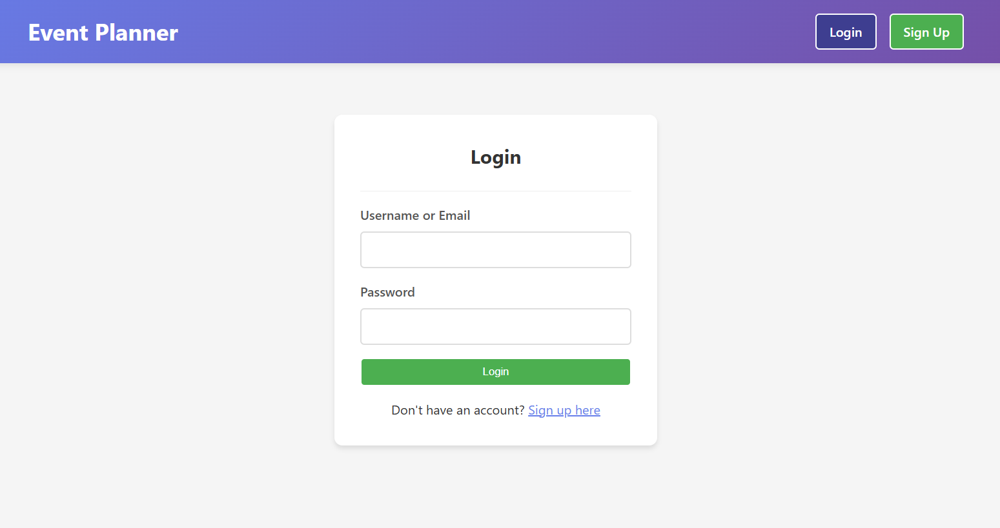
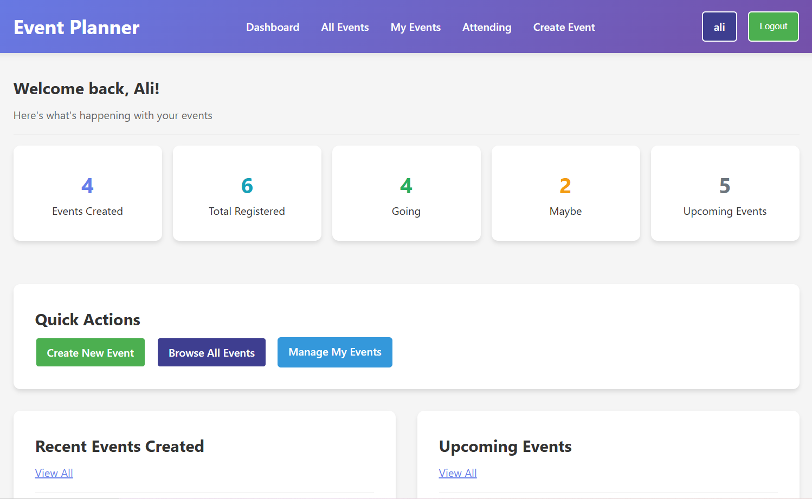
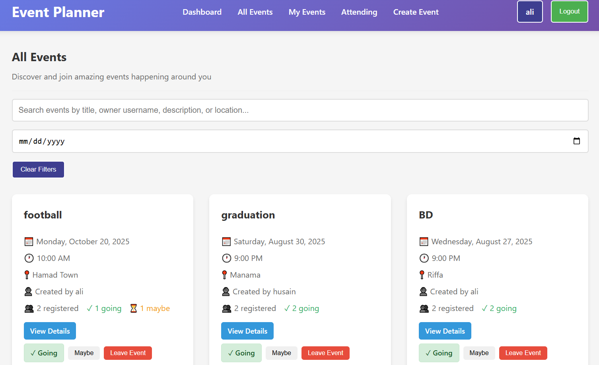

# 🎉 Event Planner - Frontend







*A modern, responsive web application for managing and attending events. Built with React and Vite for optimal performance and user experience.*

### 🎯 About the App

Event Planner is a full-featured event management platform that allows users to create, discover, and attend events. Whether you're organizing a workshop, meetup, or social gathering, Event Planner makes it easy to manage your events and connect with attendees.

**Why we built it**: To solve the common problem of event coordination and provide a seamless platform for both event organizers and attendees.

### 🚀 Getting Started

#### 📋 Planning & Resources
- **Backend Repository**: [Event Planner Backend](https://github.com/m-alhamry/Event-Planner-BE)

#### 🔧 Development Setup
1. **Clone the repository**
   ```bash
   git clone [frontend-repo-url]
   cd event-planner-frontend
   ```

2. **Install dependencies**
   ```bash
   npm install
   ```

3. **Start development server**
   ```bash
   npm run dev
   ```

### 🎨 Features

#### ✨ Core Functionality
- **User Authentication**: Secure login/signup with JWT tokens
- **Event Creation**: Create events with rich details
- **Event Discovery**: Browse and search events
- **Attendance Management**: Register, confirm, or cancel attendance
- **User Dashboard**: Personal statistics and event management
- **Responsive Design**: Works on desktop, tablet, and mobile

#### 🔍 Event Features
- **Rich Event Details**: Title, description, date, location
- **Search & Filter**: Find events by keywords, date, or location
- **Attendance Tracking**: See who's attending and manage attendance status
- **My Events**: View events you've created
- **Attending Events**: Track events you're registered for

### 🛠️ Technologies Used

#### ⚛️ Core Technologies
- **React 18+**: Modern React with hooks and functional components
- **Vite**: Lightning-fast build tool and development server
- **React Router DOM v7**: Client-side routing
- **Axios**: HTTP client for API communication

#### 🎨 Styling & UI
- **CSS3**: Modern styling with flexbox and grid
- **Responsive Design**: Mobile-first approach
- **Custom Components**: Reusable UI components

#### 🔐 Authentication & State
- **JWT Tokens**: Secure authentication
- **Local Storage**: Token persistence
- **Protected Routes**: Route-level authentication

### 🎯 Attribution

#### 📚 Libraries & Resources
- **React**: [React](https://react.dev)
- **React Router**: [https://reactrouter.com](https://reactrouter.com)
- **Axios**: [https://axios-http.com](https://axios-http.com)
- **Vite**: [https://vitejs.dev](https://vitejs.dev)
- **Icons**: [https://react-icons.github.io/react-icons/](https://react-icons.github.io/react-icons/) - optional
- **Fonts**: [Google Fonts](https://fonts.google.com/) - optional

### 🚀 Next Steps & Future Enhancements

#### 🎯 Planned Features
- **Event Categories**: Add categories and tags for better organization
- **Event Images**: Support for event photos and galleries
- **Comments & Reviews**: Allow attendees to leave feedback
- **Event Reminders**: Email/SMS notifications for upcoming events
- **Social Sharing**: Share events on social media
- **Calendar Integration**: Export events to Google/Apple Calendar
- **Advanced Search**: Filter by category, price, capacity
- **Group Events**: Create events for specific groups
- **Payment Integration**: Ticket sales and paid events

---

**Built with ❤️ by the Event Planner Developer**

### 🎓 Special Thanks
This project was developed as part of the Software Engineering Immersive course at **General Assembly - Bahrain**. 

- **Omar** - Our instructor who taught us programming fundamentals and project development
- **Mahmooud and Noor** - GA staff who provided technical support throughout the project and offered mental support and encouragement during our learning journey